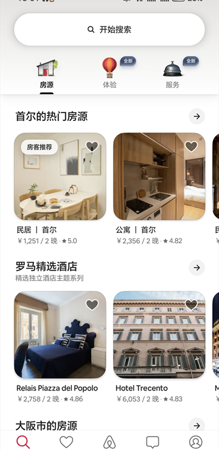
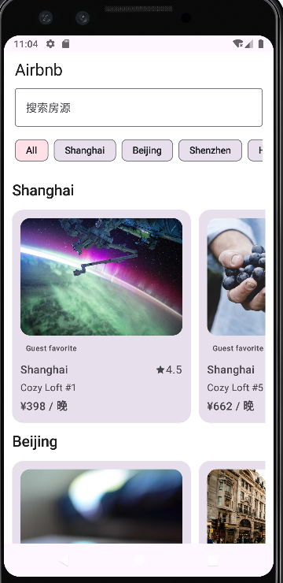
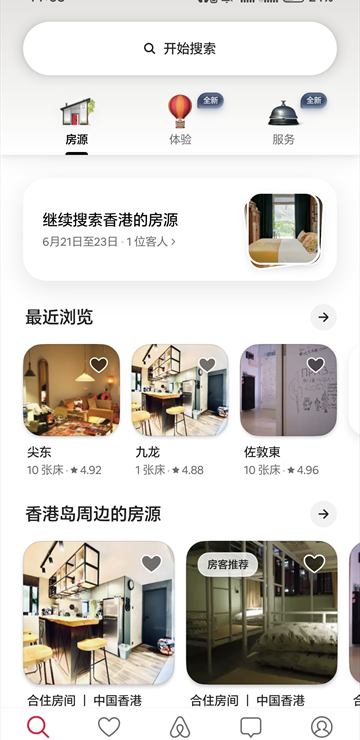
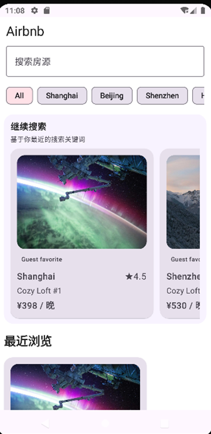
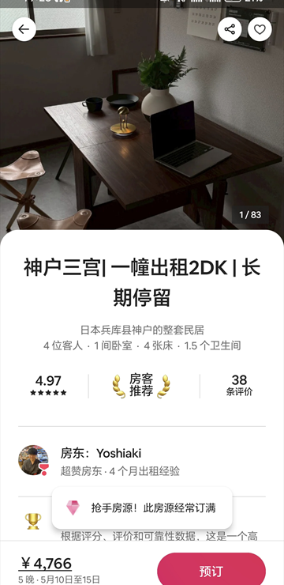
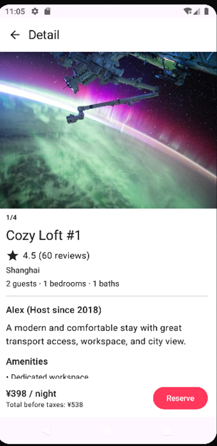

# Airbnb (Jetpack Compose 复现)

本项目使用 Kotlin + Jetpack Compose 复现 Airbnb 的核心浏览链路，当前覆盖：首页搜索/筛选、懒加载分页、详情页展示、返回状态保留。

## 截图对比（原版 Airbnb vs 本项目）

> 将图片放到 `docs/screenshots/` 后替换下方路径即可。

| 页面 | 原版 Airbnb | 本项目实现 |
| --- | --- | --- |
| 首页（搜索/筛选） |  |  |
| 首页（继续搜索，最近浏览） |  |  |
| 详情页（头图与信息） |  |  |

## App 演示视频

> 将演示视频放到 `docs/demo/app-demo.mp4`，预览图放到 `docs/screenshots/app-demo-preview.gif`。

[](docs/demo/app-demo.mp4)

## 运行说明

### 1. 环境要求

- Android Studio（建议最新版稳定版）
- JDK 17+
- Android SDK 34

### 2. 克隆并构建

```powershell
Set-Location E:\github\Airbnb
.\gradlew.bat :app:assembleDebug
```

### 3. Android Studio 运行

1. 打开项目根目录 `Airbnb`
2. 等待 Gradle 同步完成
3. 选择 `app` 配置并启动模拟器/真机运行

## 遇到的主要问题 + 解决方案

1. **Gradle / JDK 导致构建失败**
   - 问题：JDK 版本不匹配或本地 Gradle 分发包下载不完整，导致 daemon 或构建失败。
   - 解决：统一使用 JDK 17+，通过 wrapper 构建并重试依赖下载，确保 `assembleDebug` 可成功。

2. **Theme.Material3.DayNight.NoActionBar 找不到**
   - 问题：Manifest/XML 主题使用了 Material 主题父类，但依赖不完整时会在 AAPT 链接阶段报错。
   - 解决：补齐 Material 依赖并保持主题链路一致，确保资源可解析。

3. **分页触发抖动**
   - 问题：滚动到列表底部附近时，分页可能重复触发。
   - 解决：使用 `derivedStateOf + isLoadingMore + hasMore + isRefreshing` 门控，减少重复请求。

4. **从详情返回首页状态丢失**
   - 问题：返回后滚动位置和筛选条件容易重置。
   - 解决：通过 `SavedStateHandle` 保存 `scroll index/offset`、筛选和已加载条数，返回时恢复。

## 简化点与额外优化

### 做了哪些简化

- 数据源使用本地 Mock 数据（未接入真实后端 API）
- 登录、下单、支付、地图、日历完整预订链路未实现
- 样式做“高相似度复现”，未追求像素级 1:1

### 做了哪些额外优化

- 首页拆分为搜索模式 / 个性化分区模式 / 默认城市分组模式，便于面试展示架构思路
- 新增“继续搜索”“最近浏览”“推荐分区”等状态驱动模块
- 详情页采用独立 ViewModel，首页与详情状态解耦
- 异常模拟开关可控（默认关闭），便于稳定演示
- 清理 `app/build` 的 Git 跟踪噪音，仓库变更更干净
